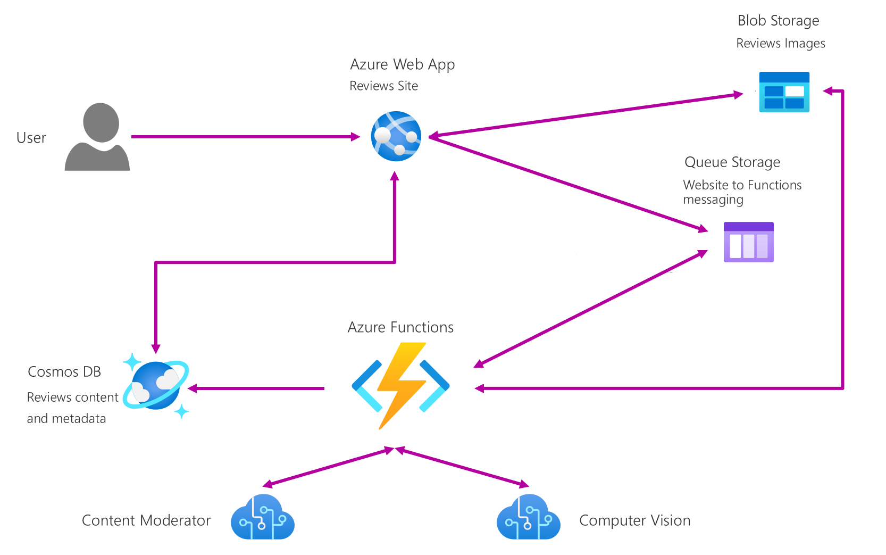

# Beers Reviews App with Cognitive Services and Azure Functions #

The sample showcases the new Azure Functions tooling. It has a website where customers submit beers reviews, stored in Azure storage blobs and CosmosDB; and an Azure Function to perform automated moderation of the beers reviews using Microsoft Cognitive Services. It uses an Azure storage queue to decouple the website from the function.

## Sample Architecture ##

_View of the architecture of the sample_

## Contributing ##

This project has adopted the [Microsoft Open Source Code of Conduct](https://opensource.microsoft.com/codeofconduct/). For more information see the [Code of Conduct FAQ](https://opensource.microsoft.com/codeofconduct/faq/) or contact [opencode@microsoft.com](mailto:opencode@microsoft.com) with any additional questions or comments.