<a name="HOLTitle"></a>
# Provision Beers Reviews assets #

---

<a name="Overview"></a>
## Overview ##

Azure Resource Manager helps automate the provisioning of plenty of resources in Azure.

In this lab, you will create the neccessary assets to run the BeersReviews website and its automatic moderation with Cognitives Services. You will also add images to populate the BeersReviews website.

---

<a name="Exercises"></a>
## Exercises ##

This hands-on lab includes the following exercises:

- [Exercise 1: Create an Azure Cloud Shell (PowerShell)](#Exercise1)
- [Exercise 2: Clone GitHub repository](#Exercise2)
- [Exercise 3: Create services with Azure Resource Manager template](#Exercise3)

<a name="Exercise1"></a>
## Exercise 1: Create an Azure Cloud Shell (PowerShell) ##

The first step in .... In this exercise, you will create .....

1. Open the [Azure Portal](https://portal.azure.com) in your browser. If you are asked to log in, do so using your Microsoft account.

2. Click on the **Cloud Shell** button at the top of the page

    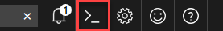

    > The Cloud Shell will appear at the bottom of the page

3. Click **PowerShell (Windows)**

    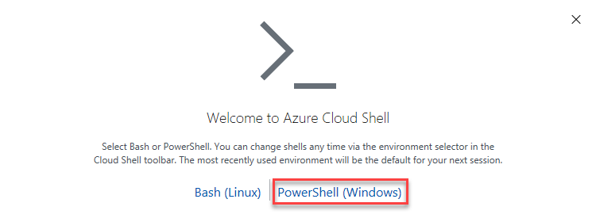

4. Select your subscription, and Click on **Create storage**. This will create a new storage account for you and create a file share to persist files.

    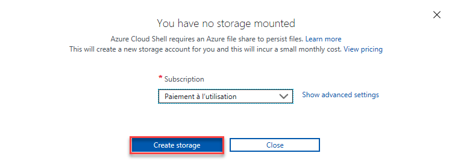

5. Your Azure Cloud Shell wil be ready within a few minutes. Make sure you choose Powershell. You can swith between Bash and Powershell in the dropdown list

    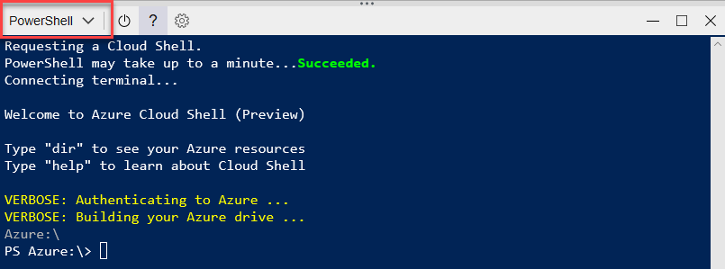

The Azure Cloud Shell is a window container. A new one will be started with your CloudDrive mapped as a volume. And you will be connected to your current Azure subscription. has been created and you have added three containers to the storage account created for it. The next step is to get code from this repo.


<a name="Exercise2"></a>
## Exercise 2: Clone GitHub repository ##

Once you have created an Azure Cloud Shell, you can use Powershell, commands, and some other SDK or application installed on it. In this exercise, you will clone the git repo into a persistent volume _CloudDrive_. This will allow you to get all the scripts necessary to create the assets. 

1. Type these commands to navigate to your CloudDrive and clone this git repository.

    > Copy and paste in Azure Cloud Shell
    >
    > - Windows: `Ctrl-insert` to copy and `Shift-insert` to paste. Right-click dropdown can also enable copy/paste.
    >   - FireFox/IE may not support clipboard permissions properly.
    > - Mac OS: `Cmd-c` to copy and `Cmd-v` to paste. Right-click dropdown can also enable copy/paste.

    ```powershell
    git clone --depth 1 --single-branch https://github.com/arnaudmaichac/devday.git
    ```

    > _-depth 1 --single-branch_ options will limit download to the tip of master branch. The full history will not be downloaded. 

    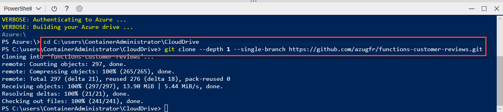

The next step is to create the assets that the Customer Reviews solution relies on.

<a name="Exercise3"></a>
## Exercise 3: Create assets with Azure Resource Manager template ##

The `deploy/azure` folder contains an Azure Resource Manager template file [deploy/azure/template.json](). This file describe all the assets that will be created:

* Storage account
* CosmosDB is the evolution of DocumentDB. DocumentDB is still the name use in the template for asset name and variables.
* Cognitives Services Computer Vision (Image analysis)
* Cognitives Services Content Moderator (Text analysis)
* Azure Web Site
* Azure Function App

In this exercise, you will create these assets.

1. In the Azure Cloud Shell, type this command to open the `parameters.json` file in `vim`. 

    ```powershell
    vim ./deploy/azure/parameters.json
    ```

    > `vim` essentials : [quick reference card](http://users.ece.utexas.edu/~adnan/vimqrc.html)
    >
    > * `x` to delete characters
    > * `i` to insert characters
    > * `Esc` to get out of insertin mode
    > * `:qn` to save and exit
    > * `!:q` to exit without saving

    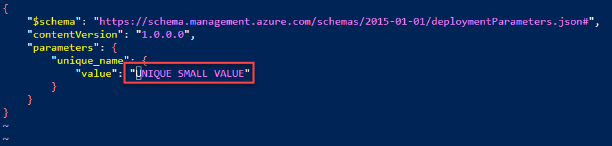

2. Select first letter of **UNIQUE SMALL VALUE**, type `x` to delete letters, repeat to keep only quotation marks.

    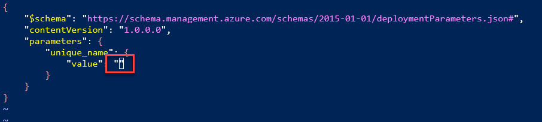

3. Type `i` and enter a small unique value . This will be used for all asset names (cognitive services, storage accounts, web app and service plan, CosmosDB) so **make sure it's unique, only use lower case characters, type between 4 - 12 alphamerical characters**.

    > **yourunique2135** will likely not work as another one will probably have been taken by another user. I did.

    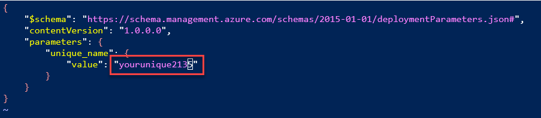

4. Type `Esc` to quit insert mode. Type `:wq` to save and quit `vim`.

5. Type this command, and copy your **SubscriptionId**. Select it and type `Ctrl-insert`

    ```powershell
    az account list
    ```

    > Under Azure: folder you can browse all assets of your current connected subscription like in a filesystem.

    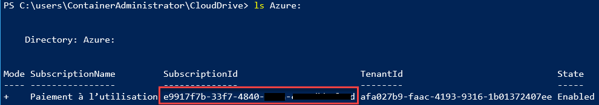

6. Type these commands to launch the script that will create the assets.

    ```powershell
    cd ./deploy/azure/
    ./deploy.ps1
    ```

    >  Use this values for each prompted variables:
    >
    >  * subscriptionId: Paste your copied **SubscriptionId** value from the previous step. Type `Shift-Insert` 
    >  * resourceGroupName: **beersreview**

    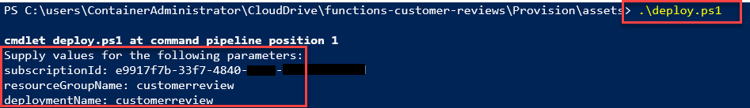

7. After a few seconds, type region: **West Europe**

    >  regions available for all assets:  East US, South Central US, North Europe, West Europe, Southeast Asia, West US 2

    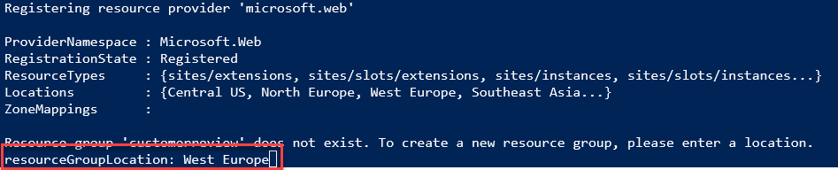

8. Wait a few minutes. Return to Azure portal, click to
    **Resource groups** > **Overview** > **beersreview** to follow assets provisioning.

    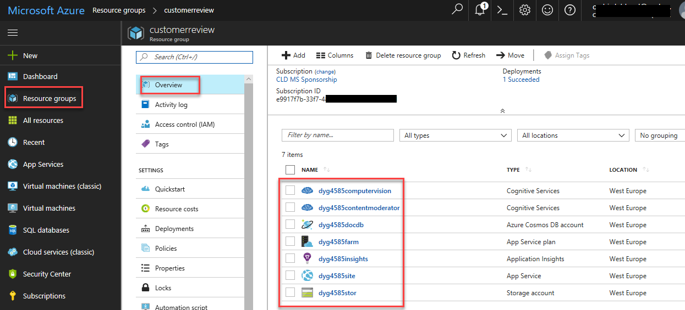

    At the end, the log should look like this one:

    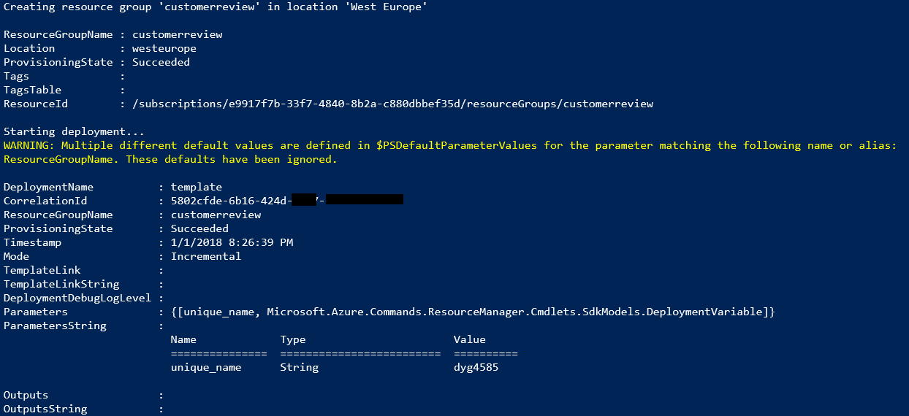

9. Open a new browser tab. Type this url http://**your_unique_name**site.azurewebsites.net

    > Site can take a few more minutes to be deployed by Kudu from this repo. This [document page](https://docs.microsoft.com/en-us/azure/app-service/app-service-deploy-complex-application-predictably) explains how to do it.


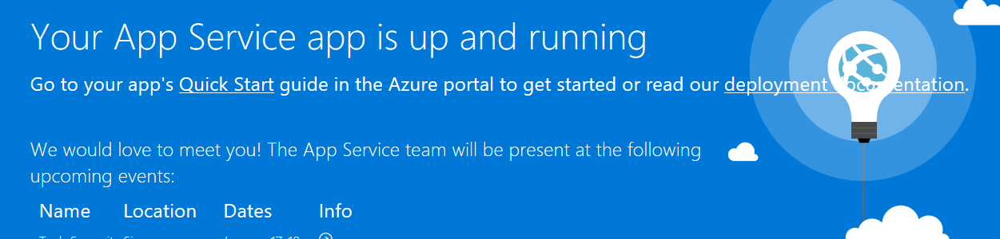

_Web site deploying_

> Web site is ready.

The assets are now all deployed and running.

<a name="Summary"></a>
## Summary ##

In this hands-on lab you learned how to:

- Create assets with Azure Resource Manager templates
- Execute PowerShell and Command srcipts in Azure Cloud Shell
- Use Azure Web Apps and deployment engine (Kudu) to automate build and deploy of a Web site from a GitHub repo.

This is just one example of how you can leverage Azure Resource Managemeer and Azure Cloud Shell to automate infrastructure. Experiment with other Azure Resource Manager templates to learn more about Azure Services and provisionning to identify additional ways in which they can aid your research or business.

